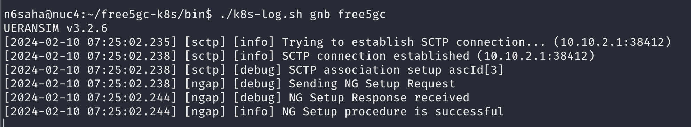
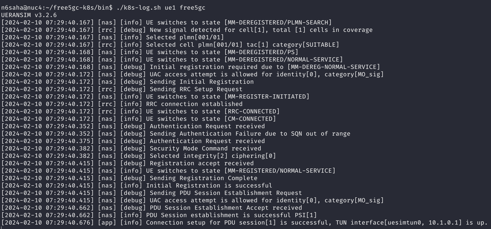
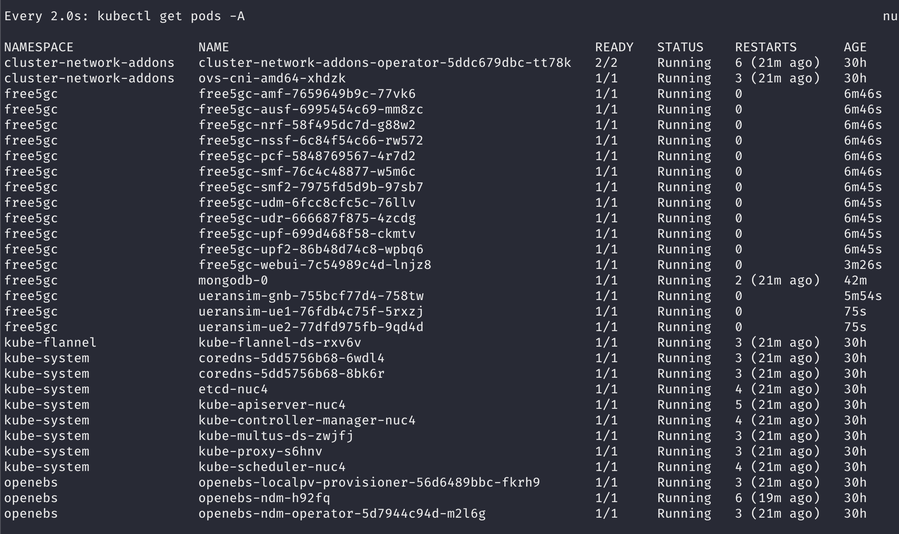
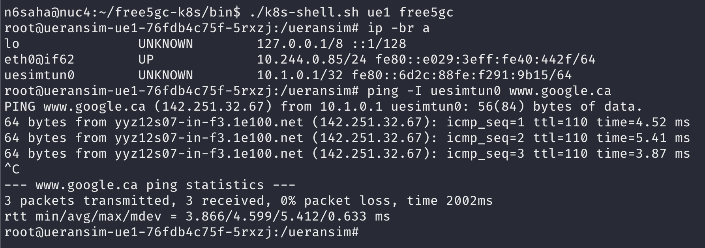

# free5gc-k8s

This repository contains the necessary files and resources to deploy and operate Free5GC, an open-source 5G core network implementation. It provides Kubernetes manifest files for deploying Free5GC using microservices, and Free5GC WebUI. Additionally, there are manifest files for deploying the MongoDB database and network attachment definitions for Free5GC.

For more information about Free5GC, please visit the [Free5GC GitHub repository](https://github.com/free5gc/free5gc).


## Directory Structure

The repository is organized as follows:

- `free5gc/`: Contains Kubernetes manifest files for deploying Free5GC using a microservices architecture.
- `free5gc-metrics/`: Contains Kubernetes manifest files for deploying Free5GC with custom UPF and SMF which expose metrics.
- `free5gc-webui/`: Contains Kubernetes manifest files for deploying the Free5GC WebUI.
- `mongodb/`: Contains Kubernetes manifest files for deploying the MongoDB database, which is a prerequisite for deploying Free5GC.
- `networks5g/`: Contains network attachment definitions for Free5GC. 
- `ueransim/`: Contains Kubernetes files for running UERANSIM-based simulated gNB and UEs.

## Deployment

**Note**: Free5GC recommends kernel version `5.4.0`. It has also been successfully tested on kernel `5.15.0-94`. Using a higher kernel version (e.g, 6.x) may result in [issues with the UPF](https://forum.free5gc.org/t/upf-est-createfar-error-invalid-argument/2111). 

**Note**: The deployment instructions assume a working kubernetes cluster with OVS CNI installed. You can optionally use the [testbed-automator](https://github.com/niloysh/testbed-automator) to prepare the Kubernetes cluster. This includes setting up the K8s cluster, configuring the cluster, installing various Container Network Interfaces (CNIs), configuring OVS bridges, and preparing for the deployment of the 5G Core network.

To deploy Free5GC and its components, follow the deployment steps below:

1. Set up OVS bridges. On each K8s cluster node, add the OVS bridges: n2br, n3br, and n4br. Connect nodes using these bridges and OVS-based VXLAN tunnels. See [ovs-cni docs](https://github.com/k8snetworkplumbingwg/ovs-cni/blob/main/docs/demo.md#connect-bridges-using-vxlan).

    <details>
    <summary>Example command for creating VXLAN tunnels</summary>

    ```bash
    sudo ovs-vsctl add-port n2br vxlan_nuc1_n2 -- set Interface vxlan_nuc1_n2 type=vxlan options:remote_ip=<remote_ip> options:key=1002
    ```
    </details>  

<br>

**Note**: The testbed-automator scripts automatically configures the OVS bridges for a single-node cluster setup, and VXLAN tunnel creation is not required. For a multi-node cluster configuration, VXLAN tunnels are used for node interconnectivity.

2. Deploy the MongoDB database using the Kubernetes manifest files provided in the `mongodb/` directory. See [deploying components](#deploying-components). Wait for the mongodb pod to be in the `Running` state before proceeding to the next step.

3. Deploy the network attachment definitions using manifest files in the `networks5g/` directory. This are used for the secondary interfaces of the UPF, SMF, etc.

4. Install the gtp5g kernel module for Free5GC. Use the `install-gtp5g.sh` script to install gtp5g v0.8.2 on nodes where UPF should run. This is a prerequisite for deploying the UPF. 

```bash
cd bin
./install-gtp5g.sh
```

5. Deploy Free5GC using the Kubernetes manifest files in the `free5gc/` directory. The pods should eventually be in the `Running` state. 

6. Deploy the Free5GC WebUI, use the Kubernetes manifest files in the `free5gc-webui/` directory.

7. The `ueransim` directory contains Kubernetes manifest files for both gNB and UEs. First, deploy UERANSIM gNB using `ueransim/ueransim-gnb` directory and wait for NGAP connection to succeed. You should see the following in the gNB log.



7. Ensure correct UE subscriber information is inserted. You can enter subscription information using the web UI (see [accessing the Free5GC webui](#accessing-the-Free5GC-webui)). Subscriber details can be found in UE config files (e.g., [ue1.yaml](ueransim/ueransim-ue/ue1/ue1.yaml)).

8. Deploy UERANSIM UEs using `ueransim/ueransim-ue/` directory. Once the UE is connected, you should see the following logs:



### Check successful deployment

All pods should be in the `Running` state.
<details>
<summary>Summary of all pods</summary>



</details>

<br>

You should be able to ping from the UEs.
<details>
<summary>Ping test</summary>



</details>

### Deploying components
We use [kustomize](https://kustomize.io/) to deploy the components.

Deploy all components in the free5gc namespace. Create the namespace if needed (`kubectl create namespace free5gc`). Use the following command for deployment, replacing <component> (e.g., free5gc-webui, free5gc) as needed:

```bash
kubectl apply -k <component> -n free5gc
```

### Accessing the Free5GC webui
1. Subscribers can be added using the Free5GC WebUI. The WebUI is accessible at `http://<node-ip>:30505`. The default username and password are `admin` and `free5gc`, respectively.

## Convenience Scripts
Some convenience scripts are available in the `bin` folder:
- **k8s-log.sh:** Use this script to view logs of a specific pod in a specific namespace. For example:
  ```bash
  ./k8s-log.sh amf free5gc
  ```
  Ensure the K8s namespace is specified (e.g., free5gc).

- **k8s-shell.sh:** Use this script to open a shell in a specific pod in a specific namespace. For example:
  ```bash
  ./k8s-shell.sh amf free5gc
  ```

- **install-gtp5g.sh**: Use this script to install gtp5g v0.8.2 on nodes where UPF should run.


## License

This repository is licensed under the [MIT License](LICENSE).

## Credits
These manifest files are heavily inspired from [towards5gs-helm](https://github.com/Orange-OpenSource/towards5gs-helm) and the Docker images used are based on [free5gc-compose](https://github.com/free5gc/free5gc-compose).

## Citation


If you use the code in this repository in your research work or project, please consider citing the following publication.

> N. Saha, A. James, N. Shahriar, R. Boutaba and A. Saleh. (2022). Demonstrating Network Slice KPI Monitoring in a 5G Testbed. In Proceedings of the IEEE/IFIP Network Operations and Management Symposium (NOMS). Budapest, Hungary, 25 - 29 April, 2022.
