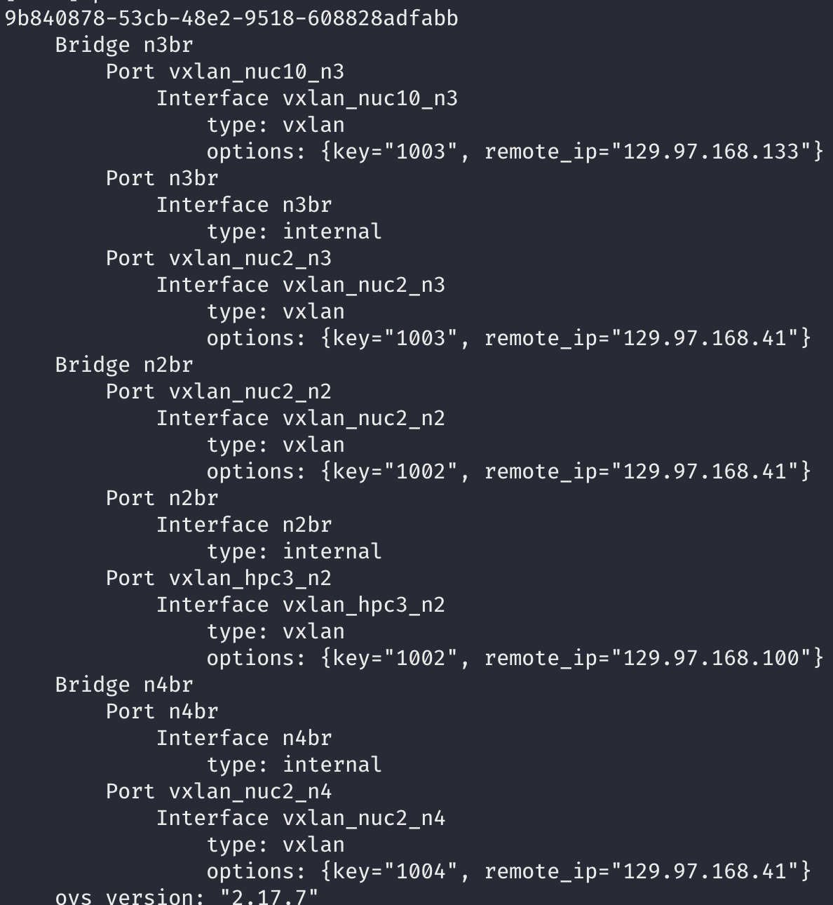

# free5gc-k8s

## How to Run

1. **Set Up OVS Bridges:**
   - On each K8s cluster node, add the OVS bridges: n2br, n3br, and n4br.
   - Connect nodes using these bridges and OVS-based VXLAN tunnels.

     Example command:
     ```bash
     sudo ovs-vsctl add-port n2br vxlan_nuc1_n2 -- set Interface vxlan_nuc1_n2 type=vxlan options:remote_ip=129.97.168.40 options:key=1002
     ```
    <details>
    <summary>Sample OVS Configuration</summary>

    

    </details>

2. **Install gtp5g v0.8.2:**
   - Install gtp5g v0.8.2 on nodes where UPF should run.

3. **Update UPF NodeSelector:**
   - Update the nodeSelector field in UPF deployment YAML files.

4. **Insert UE Subscriber Information:**
   - Ensure correct UE subscriber information is inserted via the web UI. Subscriber details are found in UE config files.

5. **Deployment Order:**
   1. Run MongoDB
   2. Run free5gc-webui
   3. Run free5gc
   4. Run ueransim-gnb
   5. Run ueransim-ue

## Convenience Scripts

Use the following scripts in the `bin` folder:

- **k8s-log.sh:**
  ```bash
  ./k8s-log.sh amf free5gc
Ensure the K8s namespace is specified (e.g., free5gc).
