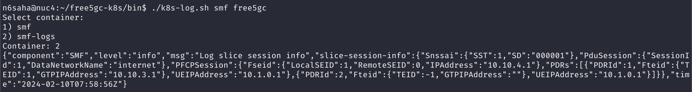
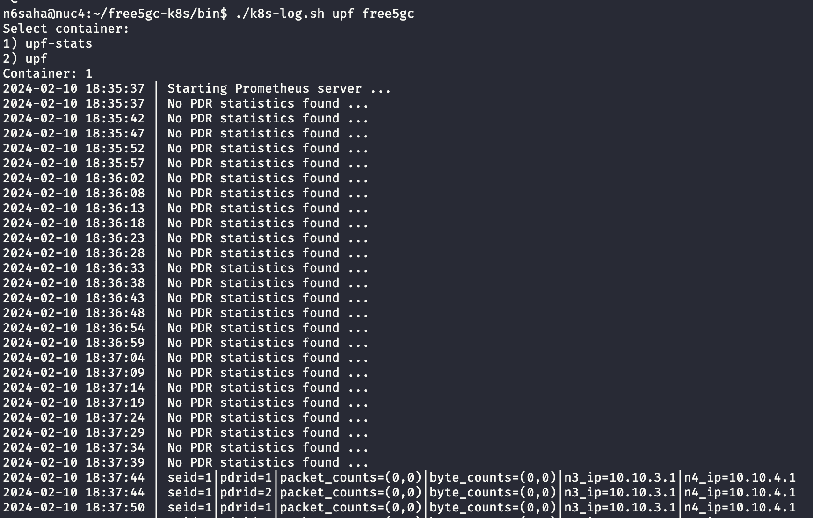
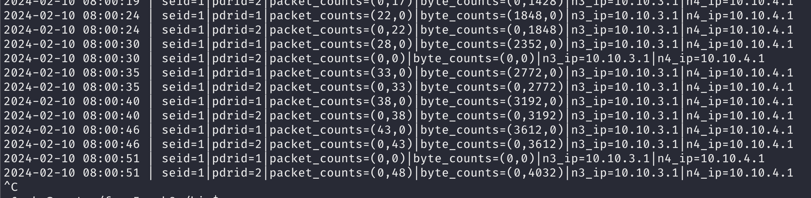

# free5gc-metrics
Experimental. Similar to [free5gc](../free5gc/), but uses custom UPF and SMF which expose metrics. The UPF and SMF have additional containers for logging and metrics.

## Installation

See the [Dockerfile](../dockerfiles/free5gc-metrics/Dockerfile) for source code and build instructions. Pre-built images are hosted on ghcr.io are used for deployment.

## Usage

### smf-logs
The smf-logs container logs show the slice and session information.

### upf stats
The UPF pod includes a stats container which logs the UPF metrics. Note that you need to send traffic from the UE to see the metrics.

Accessing UPF stats container

 

The upf-stats container logs show the UPF metrics.

